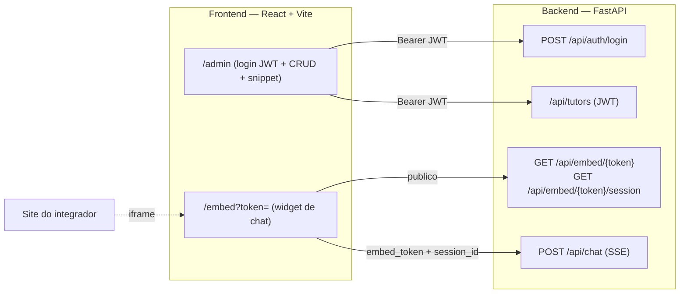

# Magister — Frontend

Frontend da plataforma **Magister**: painel administrativo de tutores de IA e widget de
chat embutivel via `<iframe>`. React + Vite + TypeScript.

> Codigo produzido **via agentes de codificacao** (frontend/backend/seguranca), conforme o
> processo do desafio DOT. Este repositorio cobre a superficie de frontend.

## Superficies

- **`/admin`** — painel protegido por **login JWT**: lista de tutores (busca, loading, empty),
  criar/editar (titulo, descricao, instrucoes do sistema, fontes, origens permitidas, status) e
  tela de embed (embed token + snippet `<iframe>` com copiar + preview ao vivo).
- **`/embed?token=<embed_token>`** — alvo do `<iframe>`: renderiza **somente** o widget de chat.
  Consome `POST /api/chat` por **SSE (streaming)**.

## Como subir localmente

Requisitos: Node 18+.

```bash
cd frontend
cp .env.example .env      # ajuste VITE_API_URL se necessario
npm install
npm run dev               # http://localhost:5173
```

Scripts: `npm run dev`, `npm run build`, `npm run preview`, `npm run lint`, `npm run format`.

## Variaveis de ambiente

Apenas variaveis `VITE_*` (publicas) chegam ao bundle. **Nenhum segredo no front.**

| Variavel       | Descricao                    | Exemplo                 |
| -------------- | ---------------------------- | ----------------------- |
| `VITE_API_URL` | URL base da API do backend   | `http://localhost:8000` |

## Fluxo de embed ponta a ponta

1. Admin faz login em `/admin` (JWT em `Authorization: Bearer`) e cria/edita um tutor. Na
   configuracao ha o toggle **Encaminhar ao Reitor quando nao souber** (`fallback_enabled`);
   o tutor de fallback (Reitor) aparece marcado, sem toggle proprio.
2. Em **Embed**, copia o snippet `<iframe src="${window.location.origin}/embed?token=<embed_token>">`,
   gerado com o `embed_token` real do tutor.
3. O site do integrador cola o snippet. O `<iframe>` carrega `/embed?token=...`.
4. O widget resolve a config publica do tutor pelo token, **resume a conversa-modelo** semeada
   (`GET /api/embed/{token}/session`) e conversa via `POST /api/chat` (SSE), reusando o
   `session_id` recebido para manter o contexto real.
5. Quando a pergunta foge do escopo e o `fallback_enabled` esta ligado, o backend escala ao
   **Reitor**; o widget so exibe a resposta final como texto.
6. O **embed token e publico e escopado** ao tutor; instrucoes, fontes e limites vivem no
   servidor. Nada sensivel trafega pelo host pai.

## Arquitetura

Diagrama canonico do sistema (backend + frontend + orquestracao multi-agente):
[`../docs/architecture.mmd`](../docs/architecture.mmd). Recorte do frontend:



## Estrutura

```
src/
├── main.tsx, App.tsx           # entry + rotas (admin | embed)
├── routes/
│   ├── admin/                  # painel Magister: MagisterApp, Shell, Login, TutorList,
│   │                           # TutorDetail (abas + preview ao vivo), Analytics, Docs,
│   │                           # Settings, store (contexto + API real), data (mapeamento
│   │                           # API->UI + dados de exemplo do Analitico/Docs) e modais
│   └── embed/Widget.tsx        # alvo do iframe (so o chat)
├── components/
│   ├── chat/                   # ChatWindow, MessageList, Composer
│   └── ui/                     # primitivas usadas pelo widget
├── lib/                        # api.ts (REST), sse.ts (stream), types.ts
├── hooks/                      # useChat (sessao de chat)
└── styles/                     # tokens.css + magister.tokens.css (design system), global.css
```

## Contrato da API (esperado do backend)

- `POST /api/auth/login` `{ username, password }` → `{ access_token }`
- `GET/POST /api/tutors`, `GET/PUT /api/tutors/{id}`, `PATCH /api/tutors/{id}/status`.
  O `TutorRead` inclui `is_fallback` (so leitura, marca o Reitor) e `fallback_enabled`
  (editavel por `PUT`: se o tutor tematico escala ao Reitor quando nao sabe).
- `GET /api/tutors/{id}/embed` → `{ embed_token, snippet }`
- `GET /api/embed/{embed_token}` → `{ title, greeting }` (config publica do widget)
- `POST /api/embed/{embed_token}/session` → `{ session_id, messages[] }` (resume publico: o
  servidor minta um `session_id` por visitante e clona o template; `session_id` nulo quando o
  tutor nao tem conversa-modelo).
- `POST /api/chat` `{ embed_token, session_id?, message }` → **SSE**, eventos:
  `{"type":"session","session_id"}`, `{"type":"token","content"}`, `{"type":"done"}`,
  `{"type":"error","code","message"}`.

## Design system

`src/styles/tokens.css` define as variaveis semanticas do widget (tema **claro** principal em
`:root`, tema **escuro** em `[data-theme="dark"]`), derivadas da marca DOT (carvao, marfim,
accent teal). O painel admin usa o design system do **Magister** gerado no **Claude Design**
(`src/styles/magister.tokens.css` + `src/routes/admin/magister.css`), com os tokens escopados
sob `.magister` para nao afetar o widget. O logo e um placeholder textual ("Magister").

## Seguranca (itens de frontend)

- **Sem segredos no bundle:** apenas `VITE_*` publicas (URL da API). JWT fica em memoria/
  `localStorage`; chaves de LLM e `JWT_SECRET` nunca chegam ao front.
- **XSS:** toda mensagem, resposta do LLM e nome de tutor sao renderizados como **texto** (React
  escapa). Nao ha `dangerouslySetInnerHTML` com dado nao confiavel.
- **Confianca no servidor:** o widget envia so `embed_token` + mensagem; identidade, instrucoes,
  fontes e limites sao resolvidos no backend.
- **Headers de seguranca por rota** (`vercel.json`, aplicados no deploy):
  - `/embed` e subpaths: `Content-Security-Policy: frame-ancestors *` (o widget e embutivel em
    qualquer site por design; a restricao real por tutor e o Origin check do backend em
    `/api/chat`). Sem `X-Frame-Options` aqui, que quebraria o embed.
  - Admin + raiz (catch-all que exclui `/embed`): `X-Frame-Options: DENY` e
    `Content-Security-Policy: frame-ancestors 'none'` contra clickjacking do painel.
  - Gerais em ambas: `X-Content-Type-Options: nosniff`,
    `Referrer-Policy: strict-origin-when-cross-origin`.
  Nota: `frame-ancestors` so vale como header HTTP na hospedagem (o navegador ignora em `<meta>`),
  por isso vive no `vercel.json`. A restricao real por tutor nao e do frontend: o backend valida o
  header `Origin` de `POST /api/chat` contra `allowed_origins`.

## Acessibilidade

Foco visivel, alvos interativos >=44px, `prefers-reduced-motion` respeitado, `aria-live` nos
toasts, dialog de confirmacao com foco gerenciado e fechamento por `Esc`.

## Limitacoes do MVP

- Um unico admin (sem gestao de usuarios); sessao via `localStorage` sem refresh token.
- Rate limit / orcamento de tokens sao aplicados pelo backend; o front apenas reflete os estados
  (`rate_limited`, `limit_reached`).
- Sem testes automatizados nesta camada (o ponto critico coberto por testes e o backend); a
  verificacao aqui e `lint` + `build`.
- **Analitico e Documentacao sao conteudo de exemplo** (o backend nao expoe metricas). As
  metricas por tutor exibidas na lista/analitico sao dados de demonstracao dos tutores semeados;
  tutores criados pela UI aparecem sem metricas.
- A **conversa-modelo** e uma sessao de demonstracao compartilhada por embed token; em producao
  cada visitante teria a propria sessao (o backend clonaria o template).

## Proximos passos

- **Streaming token a token real:** o transporte SSE ja esta pronto; hoje o backend fatia a
  resposta pronta. Ligar o streaming direto do modelo e mudanca localizada.
- **Refresh token / expiracao de sessao:** hoje o JWT expira e a UI pede novo login; um refresh
  silencioso melhoraria a experiencia.
- **Analitico real:** trocar os dados de exemplo por metricas de uso agregadas pelo backend
  (conversas, resolucao, custo por tutor).
- **Gestao de multiplos admins e papeis** (fora do escopo do MVP, um unico admin hoje).
- **Persistir o modelo de IA por tutor:** o seletor da aba Modelo e presentacional (o backend
  roteia por custo); expor o campo no contrato o tornaria efetivo.
- **Testes de frontend** (widget e guarda de rota) com Vitest + Testing Library.
